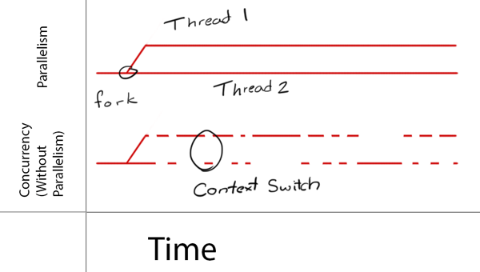
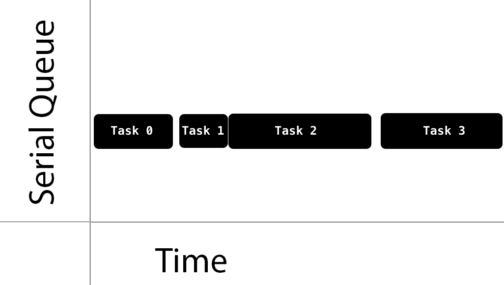
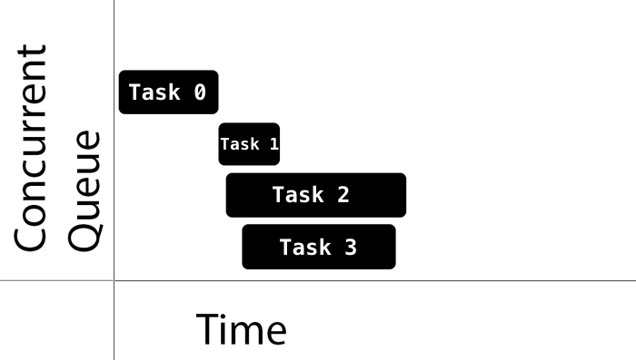

### GCD In Swift

Grand Central Dispatch (GCD) is a low-level API for managing concurrent operations. It can help improve your app’s responsiveness by deferring computationally expensive tasks to the background. It’s an easier concurrency model to work with than locks and threads.

In this Grand Central Dispatch tutorial, you’ll delve into basic GCD concepts, including:

* Multithreading
* Dispatch queues
* Concurrency

#### 1. Learning Concurrency
In iOS, a process or application consists of one or more threads. The operating system scheduler manages the threads independently of each other. Each thread can execute concurrently, but it’s up to the system to decide if, when and how it happens.

Single-core devices achieve concurrency through a method called time-slicing. They run one thread, perform a context switch, then run another thread.

Multi-core devices, on the other hand, execute multiple threads at the same time via parallelism.

GCD is built on top of threads. Under the hood, it manages a shared thread pool. With GCD, you add blocks of code or work items to dispatch queues and GCD decides which thread to execute them on.

As you structure your code, you’ll find code blocks that can run simultaneously and some that should not. This allows you to use GCD to take advantage of concurrent execution.
#### 2. Understanding Queues
As mentioned before, GCD operates on dispatch queues through a class aptly named DispatchQueue. You submit units of work to this queue, and GCD executes them in a FIFO order (first in, first out), guaranteeing that the first task submitted is the first one started.

Dispatch queues are thread-safe, meaning you can simultaneously access them from multiple threads. GCD’s benefits are apparent when you understand how dispatch queues provide thread safety to parts of your code. The key to this is to choose the right kind of dispatch queue and the right dispatching function to submit your work to the queue.

Queues can be either serial or concurrent. Serial queues guarantee that only one task runs at any given time. GCD controls the execution timing. You won’t know the amount of time between one task ending and the next one beginning:

Concurrent queues allow multiple tasks to run at the same time. The queue guarantees tasks start in the order you add them. Tasks can finish in any order, and you have no knowledge of the time it will take for the next task to start, nor the number of tasks running at any given time.

This is by design: Your code shouldn’t rely on these implementation details.

See the sample task execution below:

Notice how Task 1, Task 2 and Task 3 start quickly, one after the other. On the other hand, Task 1 took a while to start after Task 0. Also notice that while Task 3 started after Task 2, it finished before Task 2.

The decision of when to start a task is entirely up to GCD. If the execution time of one task overlaps with another, it’s up to GCD to determine if it should run on a different core — if one is available — or instead perform a context switch to run a different task.
#### 3. Understanding Queue Types
GCD provides three main types of queues:

* Main queue: Runs on the main thread and is a serial queue.
* Global queues: Concurrent queues shared by the whole system. Four such queues exist, each with different priorities: high, default, low and background. The background priority queue has the lowest priority and is throttled in any I/O activity to minimize negative system impact.
* Custom queues: Queues you create that can be serial or concurrent. Requests in these queues end up in one of the global queues.

When sending tasks to the global concurrent queues, you don’t specify the priority directly. Instead, you specify a quality of service (QoS) class property. This indicates the task’s importance and guides GCD in determining the priority to give to the task.
The QoS classes are:

* User-interactive: This represents tasks that must complete immediately to provide a nice user experience. Use it for UI updates, event handling and small workloads that require low latency. The total amount of work done in this class during the execution of your app should be small. This should run on the main thread.
* User-initiated: The user initiates these asynchronous tasks from the UI. Use them when the user is waiting for immediate results and for tasks required to continue user interaction. They execute in the high-priority global queue.
* Utility: This represents long-running tasks, typically with a user-visible progress indicator. Use it for computations, I/O, networking, continuous data feeds and similar tasks. This class is designed to be energy efficient. This gets mapped into the low-priority global queue.
* Background: This represents tasks the user isn’t directly aware of. Use it for prefetching, maintenance and other tasks that don’t require user interaction and aren’t time-sensitive. This gets mapped into the background priority global queue.
#### 4.  Scheduling Synchronous vs. Asynchronous Functions
With GCD, you can dispatch a task either synchronously or asynchronously.

A synchronous function returns control to the caller after the task completes. You can schedule a unit of work synchronously by calling DispatchQueue.sync(execute:).

An asynchronous function returns immediately, ordering the task to start but not waiting for it to complete. Thus, an asynchronous function doesn’t block the current thread of execution from proceeding to the next function. You can schedule a unit of work asynchronously by calling DispatchQueue.async(execute:).

#### 5. Managing Tasks
You’ve heard about tasks quite a bit by now. For the purposes of this tutorial, you can consider a task to be a closure. Closures are self-contained, callable blocks of code you can store and pass around.

Each task you submit to a DispatchQueue is a DispatchWorkItem. You can configure the behavior of a DispatchWorkItem, such as its QoS class or whether to spawn a new detached thread.

### Tóm tắt kiến thức

GCD là api cấp độ thấp giúp các lập trình viên xử lý nhiều tác vụ cùng lúc, Cải thiện hiệu năng của ứng dụng., tối ưu hoá việc sử dụng Multible thread

#### Thread

- Giúp cho chương trình thực hiện cùng lúc **nhiều công việc**
- Sử dụng Thread để tăng hiệu suất của chương trình. Thay vì tất cả mọi công việc được thực hiện trên **Main Thread** thì bạn có thể chia ra nhiều thread để thực hiện nhiều công việc.
- Nó tốt cho việc `pre-load` data
- **Tách biệt** nhiều công việc xử lý, như: giao diện, WS, tính toán, database…
- Thread thuộc mức `low-level` trong hệ thống, nên gây khó khăn cho việc quản lý và thực hiện các công việc đồng thời.

####  Concurrency vs. Parallelism

- **Concurrency:** Đó là khái niệm nhiều thứ xảy ra cùng một thời điểm. Là một thuộc tính của chương trình.
- **Parallel:** Đó thực thi nhiều công việc song song, là một thuộc tính của máy
- Trong quá khứ, **Concurrency** là yêu cầu tạo thêm thread để vào quá trình xử lý. Nhưng việc quản lý thread là một điều không đơn giản.

#### Lợi ích của GCD đem lại

- **GCD** là cách phổ biến nhất để thêm một thread.
- Chỉ cần định nghĩa các các công việc và thêm chúng vào **queue** để thực hiện.
- Mọi công việc **handle thread** thì đã tự động thực hiện.
- Đó là cách đơn giản nhất để thực hiện các công việc đồng thời và bất đồng bộ
- Sử dụng đơn giản và nhiều task được thực hiện trong một thread

#### Dispatch Queue

- GCD cung cấp 1 dispatch queue bằng DispatchQueue.
- Nhiệm vụ:
  - Quản lý các tác vụ được thêm vào
  - Theo kiểu FIFO
- Dispatch queue là thread an toàn & có thể truy cập nó từ bất cứ đâu.
- GCD sẽ rất là hiệu quả khi bạn hiểu được về ứng dụng của bạn và những thứ bạn cần.

#### Các loại Queue

Có 3 loại queue mà GCD cung cấp:

- Main Queue
  - Thực thi trên main thread
  - Là 1 serial queue

- Global Queue
  - Là concurrent queue
  - Chia sẻ trên toàn bộ hệ thống
  - Có 4 mức độ ưu tiên: high, default, low và background

- Custom Queue
  - Có thể tạo ra là 1 serial hay concurrent queue