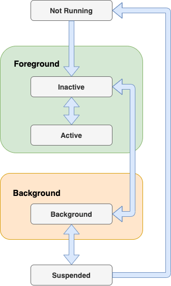

## Life Cycle app

#### 1. The iOS App Life Cycle: A High-Level Overview
An iOS application runs into several states, which are called the state of the Application life cycle. Every iOS developer must be aware of the app life cycle, which helps to understand the application's behavior. Every iOS application passes through the following states as it runs.

* **Not Running**: the app is considered to be in a Not Running state when it is not yet launched or terminated by the system or user.
* **Inactive**: the app is in an inactive state when it is in the foreground but receiving events. In other words, we can say that it acts like a bridge state in which the app remains briefly when it transitions to a different state.
* **Active**: it is a normal mode for the app when it is in the foreground state and receiving all the user events.
* **Background**: the app transitions into the background state when the user taps on the home screen while using the application, or it requires some extra execution time. When the app is about to be suspended, then also transitions into this state for a small amount of time. In this state, the app remains in the background and executes the code.
* **Suspended**: in this state, the app remains in the background and doesn't execute the code. The app is automatically moved to this state. In this state, the app remains in memory. However, the foreground apps are always given priority over suspended apps and can be purged any time without notice.

We must notice that when we build and run an iOS application in XCode, the main entry point of the application is UIApplicationDelegate, which is a protocol that the application must implement to get notified of several user events like app launch, the app goes into the background, the app goes to the foreground, push notifications, etc.

The UIApplicationDelegate contains certain app lifecycle methods that are notified when the app starts running. The UIApplicationDelegate methods are given below.

* **application: didFinishLaunchingWithOptions**:-> Bool: when the application is launched initially, this method is called. We can do any initial setup for the application in this method like firebase configuration, user navigation, etc. The storyboard is loaded at this point, but we can maintain the state restoration.
* **applicationWillEnterForeground**: this method is called after didFinishLaunchingWithOptions. It is also called when the application comes from background to foreground.
* **applicationDidBecomeActive**: this method is called after applicationWillEnterForeground. If we need to perform any particular task when the app comes into the foreground, like font update, etc., then we can place the code in this method.
* **applicationWillResignActive:** this method is notified when the application is about to become inactive. For example, the user receives a phone call; the user presses the home button, etc.).
* **applicationDidEnterBackground:** this method is notified when the application goes into a background state after become inactive.
* **applicationWillTerminate:** this method is called when the application is about to be finally terminated from memory. If we need to perform any final cleanups, then we can place the code in this method.