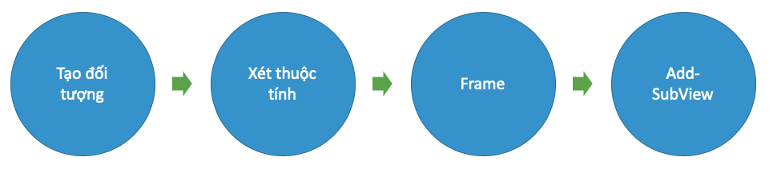

## I ViewController in Swift

There are three ways to create UI (Attached with a viewController class ).
1. From the .xib
2. From Code
3. By Storyboard

#### 1. init(coder:)
ViewControllers are usually created from storyboards. When this is the case, init(coder:) is the initializer that gets called and you have to override.

It provides an NSCoder instance as a parameter, which you need only if you are using iOS serialization APIs. This is not used often so you can ignore the parameter. If you are curious, serialization transforms an object into a byte stream that you can save on a disk or send over the network.
#### 2. init(nibName:bundle:)
##### When it is called / When it is used :
* Sometimes you might decide to put your view controller’s interface in a separate nib file instead of a storyboard. This might happen, for example, to work in a larger team where different members need to change view controller interfaces without affecting the work of others. You also might have a project that was created when storyboards did not exist yet, so every view controller had its own nib file. Keep in mind that if your main storyboard starts getting too big, you can split it into more storyboards. You do not need to move every view controller in a separate nib file.(su dunụ file xib thay vi storyboard)
* If you create a view controller from a nib file, this initializer is called instead of init(coder:).
#### 3. loadView
This method is used when a ViewController is created from code. It's good not to do anything on this method. If ViewController is made from .xib or storyboard.

What Do in View Load : loadView( ) is a method managed by the ViewController. The ViewController calls it when its current view is nil. loadView( ) basically takes a view (that you create) and sets it to the ViewController’s view (super view).

This is the method that creates the view for the view controller. You override this method only in case you want to build the whole interface for the view controller from code. Don’t use this unless there is a valid reason. (su dunụ để load lai view khi caầ)

#### 4. viewDidLoad
This method is loaded once in the ViewController life cycle. It's Called When all the views are loaded. You Can do Some common tasks in this method : (chỉ load một lần duy nhất khi gọi ViewController và xử lý một số tác vụ chung)
1. Network call which needs Once.

2. User Interface

3. Other tasks that are needed to do Once
**Application :**

* It is common to use this method to populate the user interface of the view controller with data before the user sees it.(xử lý dữ liệu trước khi hiển thị giao diện người dùng)
* It is also a good place where to start some background activity where you need to have the user interface in place at the end.
* A common case is network calls that you need to do only once when the screen is loaded.(gọi mạng một lần trước khi hiển thị)
* A good place to init and set up objects used in the viewController.
  
**The important thing to remember :*

* This method is called only once in the lifetime of a view controller, so you use it for things that need to happen only once. If you need to perform some task every time a view controller comes on screen, then you need the following methods.
* Keep in mind that in this lifecycle step, the view bounds are not final.
#### 5. viewDidAppear
If you need to repeat them (background activity/ UI changes/ make network calls ) to update the data in the view controller,viewDidAppear(_: ) is more appropriate to do so.(nếu cần thực hiện hoạt động background , change UI, thay đổi trạng thái network)
Method này được gọi sau khi mà ViewController đã hiển thị trên màn hình.
Bạn có thể sử dụng nó để bắt đầu animation trong user interface, để bắt đầu play video hay audio, hoặc bắt đầu sưu tập data từ network.
#### 6.viewWillAppear
This method is called every time before the view is visible to and before any animation is configured. In this method view has bound but orientation is not set yet. You can override this method to perform custom tasks associated with displaying the view such as hiding fields or disabling actions before the view becomes visible.

You override this method for tasks that you need to repeat every time a view controller comes on screen. This method can be called multiple times for the same instance of a view controller.
Notifies the view controller that its view is about to be added to a view hierarchy
Application :

* Usually, you use this method to update the user interface with data that might have changed while the view controller was not on the screen.
* You can also prepare the interface for animations you want to trigger when the view controller appears.
viewDidLoad V/S viewDidAppear :
* The code you need to execute only once should go into an initializer or viewDidLoad().
* In this step, the view has bounds defined but the orientation is not applied.
#### 7. viewWillLayoutSubviews
It doesn’t do Anything by default. When a view’s bounds change, the view adjusts the position of its subviews. The view controller can override this method to make changes before the view lays out its subviews.

Called to notify the view controller that its view is about to layout its subviews.
This method is called every time the frame changes for example when rotating or it’s marked as needing layout. It’s the first step where the view bounds are final.
If you are not using auto-resizing masks or constraints and the view size changes you probably want to update the subviews here.(chuẩn bị thay đổi UI của layout subview)
#### 8. viewDidLayoutSubviews
This method is called after the viewController has been adjusting to its subview following a change on its bound. Add code here if you want to make changes to subviews after they have been set.

Called to notify the view controller that its view has just laid out its subviews.
Make additional changes here after the view lays out its subviews.
#### 9. viewDidAppear
This method is called after the view is present on the screen. Usually, save data to core data or start animation or start playing a video or a sound, or start collecting data from the network This type of task good for this method.

This method gets called after the view controller appears on the screen.
You can use it to start animations in the user interface, to start playing a video or a sound, or to start collecting data from the network.
### 10. viewWillDisappear
This method is called before the view is removed from the view hierarchy. The View is Still on the view hierarchy but has not been removed yet. any unloaded animations haven’t been configured yet. Add code here to handle timers, hide the keyboard, canceling network requests, and revert any changes to the parent UI. Also, this is an ideal place to save the state.

Before the transition to the next view controller happens and the origin view controller gets removed from the screen, this method gets called.
You rarely need to override this method since there are a few common tasks that need to be performed at this point, but you might need it. (it dung)
#### 11. viewDidDisappear
After a view controller gets removed from the screen, this method gets called.
You usually override this method to stop tasks that should not run while a view controller is not on screen.
For example, you can stop listening to notifications, observe other objects' properties, monitor the device sensors, or a network call that is not needed anymore.
(sử dụng để dừng một số hoạt động ở view hiện tại)
#### 12.deinit()
Like every other object, before a view controller is removed from memory, it gets deinitialized.
Application :
- You usually override deinit() to clean resources that the view controller has allocated that are not freed by ARC.
- You can also stop tasks you did not stop in the previous method because you wanted to keep them in the background.
Beware :
A view controller going out of the screen does not mean that it will be deallocated afterward. Many containers keep view controllers in memory. For example, as you go deeper into a navigation controller, all the previous view controllers stay in memory. A navigation controller releases view controllers only when navigating back up the hierarchy. For this reason, you have to keep in mind that a view controller that is not on the screen still works normally and receives notifications. Sometimes this is desirable, other times it isn’t, so you need to keep this in mind while developing your app.
## II View in Swift
* View is a rectangle, with coordinates and dimensions 
* The coordinates & dimensions of View are called frames
* Can receive events from users
* There is hierarchy
    - A view is contained in its super view (parent view)
    - A view has many subviews (child views)
    - There are many ways to initialize a view, basically:
      - Running code
      - Drawing
      - Drag and drop interface
* With the above concept, we have a special view, which is UIWindow, some points to note are as follows:
Windows does not display app content, but it provides a basic container to hold views.
* Views define the part of the screen where you want to display content, such as images, text, ...
* Every app has at least 1 window and 1 view to display app content.
#### 1. Basic properties of View
* @property frame
* @property bounds
* @property center
* @property transform
* @property alpha
* @property backgroundColor
* @property contentStretch
##### 1.1 Frame & Bounds
Data Type
- Both are CGRect
CGPoint : origin –> coordinates
CGSize : size –> size
- CGPoint
CGFloat x
CGFloat y
- CGSize
CGFloat width
CGFloat height
- Properties
Defines a rectangular area with coordinates and dimensions
Read-only
- Differences
Frame is relative to the coordinate system of the superview containing it (so vs he truc toa do chua no)
Bounds is relative to its own coordinate system
##### 1.2 Create UI using code
There are many ways to create a view and the first way is to start with running code. We have a 4-step process for creating any view (applies a lot later)

##### 1.2 Catching View Events with Code
- One of the most basic and first events is the user event
- Some sub-classes of UIView have built-in capabilities to catch these events. For example:
UIButton
UISwitch
UISlider
…
To catch this event, there are 3 important points
* target: indicates which view catches the event
* selector: function to execute when the event is caught
* state: state or gesture type of the user manipulating the view